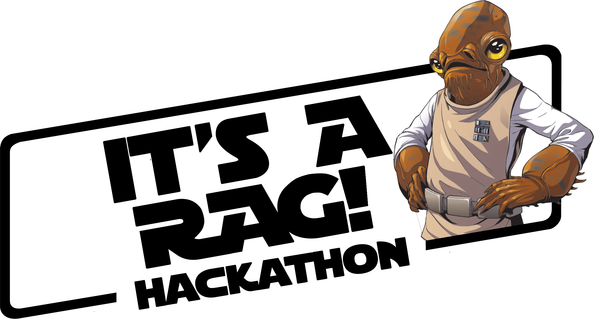

  

# IT'S A RAG Hackathon

Welcome to **IT'S A RAG** Hackathon.

🛠️ Build, innovate, and Hack together! 🛠️ It's time to start building AI applications using the power of RAG (Retrieval Augmented Generation). 🤖 + 📚 = 🔥

Large language models are powerful language generators, but they don't know everything about the world. RAG (Retrieval Augmented Generation) combines the power of large language models with the knowledge of a search engine. This allows you to ask questions of your own data, and get answers that are relevant to the context of your question.

**IT'S A RAG** Hackathon is your opportunity to get deep into RAG and start building RAG yourself: The challenges are designed to be completed in order and they increase their complexity as you progress through them.

This hackathon is designed to help you learn and grow your skills in the field of AI and RAGs: you will learn how to build RAG apps on top of Azure AI in multiple models (Open AI / Phi-3.5) with multiple retrievers (AI Search, Azure SQL) with a defined Dataset or even your own data sources! 

You'll learn about a popular framework, LangChain, plus the latest technology, like agents and multi modal.

> This Hackathon is providing a selection of datasets to be used **BUT** you can bring your own data instead.

A bit more of a deep-dive on topics? Through the course of the hackathon, you will learn how to:

- Connect with LLMs (Open AI / Microsoft Phi3.5)
- Ingest your Docs in Azure AI Search
- Prepare your unstructured data (Azure Document intelligence) and add different data sources (PDFs, Databases) with Langchain
- Create your first multi-agent solution
- Create your first agent calling an API to complete an action
- Deploy everything in Azure using Azure Container Apps.

-----------------------------------------------------------------
## The Challenges

The challenges are designed to be completed in order with increasing complexity: We will start using the Azure portal and the Azure AI Foundry, then we will move to Jupyter Notebooks and finally we will deploy the application using Azure Container Apps.

The list of the challenges is the following:

- **Challenge 0: Learn the Basics**: You will understand the basics of generative AI including tools and models.
- **Challenge 1: Establish the Plan**: You will prepare your development environment and deploy the infrastructure.
- **Challenge 2: Play with Azure AI Foundry**: Connect to an LLM for chat completion, ingest your docs in AzureSearch, play with the APIs.
- **Challenge 3: Start Coding**: Use Jupyter Notebook to connect with LLM and ingest the first documents.
- **Challenge 4: Advanced RAG**: You will ingest documents using the most advanced techniques (Advanced RAG) that take into account tables and images.
- **Challenge 5: Multi-Source, Multi-Agent RAG**: You will add additional sources (SQL Server) to your RAG and create a multi-agent architecture.
- **Challenge 6: Add Actions**: You will add actions to your RAG to perform API calls to external services.
- **Challenge 7: Deploy your App**: You will develop and deploy your application using Azure Container Apps based on the Jupyter Notebooks code you developed.

-----------------------------------------------------------------
## The Datasets

For the dataset, you can use the provided datasets or bring your own data.
We are providing different datasets for different industries; you can choose the one that better fits your needs.

### FSI Dataset
The provided dataset contains the Annual (10-K) SEC reports in PDF format for the years 2019-2023 for Apple, Microsoft, Amazon, Nvidia, and Intel.
it also contains a SQL table with Stock values for the years 2019-2023 for Apple, Microsoft, Amazon, Nvidia, and Intel.
You can have a look at the datasets in the following path: `./data/fsi/pdf/`

### Healthcare Dataset
TBD

### Retail Dataset
TBD

### Unspecified Dataset
The provided dataset contains a set of free books in PDF format from [NASA](https://www.nasa.gov/).
You can have a look at the datasets in the following path: `./data/unspecified/NASA/`

-----------------------------------------------------------------
## Getting Started

### Codespaces and DevContainers

This respository has been configured to support GitHub Codespace and DevContainers.

 

> [!WARNING]
> Do NOT `git clone` the application under Windows and then open a DevContainer. 
> This would create issues with file end of lines. For DevContainer click on the button 
> above and let Visual Studio Code download the repository for you. Alternatively you 
> can also `git clone` under Windows Subsystem for Linux (WSL) and ask Visual Studio Code to
> `Re-Open in Container`.

the repository is organized in the following way:

- **.devcontainer**: Contains the configuration to create a development container with all the necessary tools to complete the challenges.
- **assets**: Contains images and other assets used for the documentation and challenges instructions.
- **challenges**: Each challenge is a folder with a markdown file that contains the instructions to complete the challenge.
- **data**: Contains the datasets you will use during in the challenges.
- **infra**: Contains the infrastructure as code to deploy the necessary resources to complete the challenges.
- **lib**: Contains custom libraries you will use during the challenges.
- **scripts**: Contains scripts to help you to complete the challenges.
- **src**: Contains the source code to complete during the challenges.

### Prerequisites

#### Azure Subscription
This Hackathon is designed to be run on Azure. Each participant needs an Azure subscription to complete the challenges.

> [!NOTE] 
> To complete the challenges you need to have at least the following roles assigned:
> * Contributor
> * User Access Administrator
> * Storage Blob Data Contributor

#### Development Environment

This Hackathon requires you to develop in Python. You can use any IDE you prefer, but we recommend using Visual Studio Code.

**We strongly recommend using the provided development container. This container has all the necessary tools to complete the challenges.**

Here's the minimal list of tools you need to have installed:

* Visual Studio Code
* Python 3.12
* Azure CLI 2.63.0
* Azure Developer CLI extension 1.9.7
* Windows Subsystem Linux 2
* Docker Desktop 4.34 with WSL2 Engine

We also suggest adding the following extensions to your Visual Studio Code:

* GitHub Copilot
* GitHub Copilot Chat
* GitHub Repositories
* Jupyter
* Docker
* Postman
* PowerShell
* Python Environment Manager
* Remote Development
* vscode-pdf
* Bicep
* YAML

Feel free to use any other tools/extensions you think are necessary for your development environment and could help you to complete the challenges.

Have fun! 🚀🚀

## What's New (2025-02-03)

- Devcontainer has been rebuilt using a custom image (x64 + arm64) with all the necessary tools to complete the challenges. This reduce significantly the time to setup the dev environment and the errors in the build.
- Python version used in the devcontainer has been set to 3.12. Many libraries are not yet compatible with 3.13.
- The Challenges instructions have been updated based on feedback received and to provide more details. Especially Challenge 1 and Challenge 2 includes more step-by-step instructions.
- Custom libraries have been updated to the match the latest version of the Document Intelligence and LangChain.
- Bicep files for AI Foundry now deploy SQL Server S2 SKU instead of the free tier to avoid issues with the number of instances.
- Python libraries have been updated to the latest version where possible.
- Updated version of the Attendee Guide
- Removed Azure Storage Explorer extension (deprecated).

## Content Owners

<table>
   <tr>
    <td align="center">
      <a href="https://github.com/francesco-sodano" title="Francesco Sodano's GitHub Profile">
         
        <strong>Francesco SODANO</strong>
         
        📢
      </a>
    </td>
    <td align="center">
      <a href="https://github.com/dbroeglin" title="Dominique Broeglin's GitHub Profile">
         
        <strong>Dominique BROEGLIN</strong> 
        📢
      </a>
    </td>
    <td align="center">
      <a href="https://github.com/cweo" title="Johan Bartas' GitHub Profile">
         
        <strong>Johan BARTHAS</strong> 
        📢
      </a>
    </td>
    <td align="center">
      <a href="https://github.com/abossard" title="Andre Bossard's GitHub Profile">
         
        <strong>Andre BOSSARD</strong> 
        📢
      </a>
    </td>
    <td align="center">
      <a href="https://github.com/piizei" title="Petteri Johansson's GitHub Profile ">
         
        <strong>Petteri JOHANSSON</strong> 
        📢
      </a>
    </td>
    <td align="center">
      <a href="https://www.linkedin.com/in/christine-traver-97381329/" title="Christine Traver's LinkedIn Profile">
         
        <strong>Christine TRAVER</strong> 
        📢
      </a>
    </td>
</tr></table>
