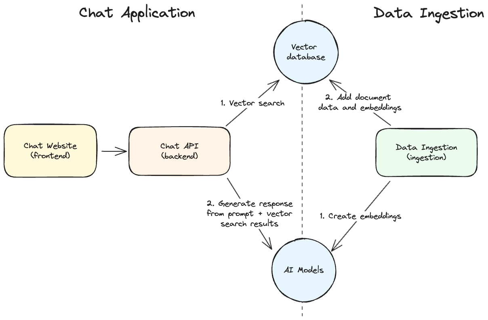
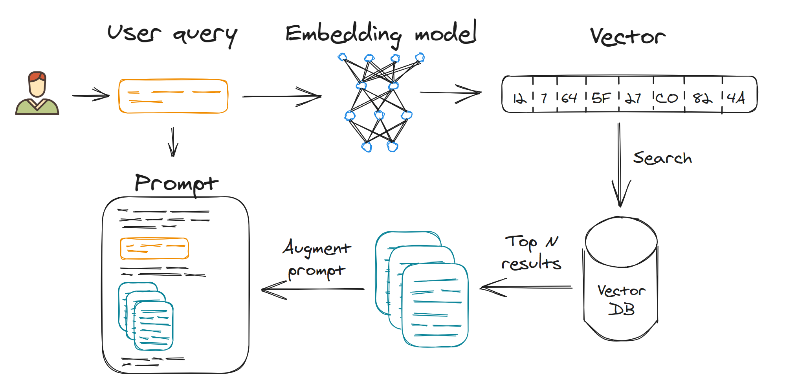

# Challenge 0: Learn the Basics

## Introduction

Organizations of all sizes have amassed a plethora of documents over time. While generative AI, such as ChatGPT, can provide answers about general knowledge and historical events with reasonable accuracy, they can also be tailored to answer questions based on a company's internal documents.

In this Challenge, you will learn the basic concepts of:

- What is a Large Language Model (LLM) and what are its main characteristics.
- High-Level Architecture of a Retrieval-Augmented Generation (RAG) Application.
- What is a Retrieval-Augmented Generation (RAG).
- What does it mean to chunk and embed documents.
- Which are the most common technologies (from Microsoft or Open Source) that can be used in Azure to build a RAG Application.

## Language Models: Learn how to choose wisely

Large Language Models (LLMs) are a type of artificial intelligence that can generate human-like text based on the input it receives. These models are trained on vast amounts of text data to learn the patterns and structures of human language, enabling them to generate coherent and contextually relevant responses to a wide range of prompts.

Before going further, let's understand two important concepts related to LLMs: Parameters and Tokens.

- **Parameters**: The number of parameters in a model is a key indicator of its size and complexity. Larger models have more parameters, which allows them to capture more complex patterns and generate more accurate text. However, larger models also require more computational resources (CPU, GPU, RAM) and storage. To give an example, Llama3.1-405B has 405B parameters and requires 810GB of RAM while Phi-3.5-mini has 3.8B parameters and requires 2GB of RAM.

- **Tokens**: The token size of a model refers to the number of unique tokens or words it can process. Larger token sizes enable models to understand and generate more diverse and nuanced text, making them more versatile and capable of handling a wider range of tasks. One token is (as a general rule of thumb) 4 chars in English. Usually, the tokens are also used for billing purposes in pay-per-use models. Do you want to test? Try [OpenAI Tokenizer](https://platform.openai.com/tokenizer)

Now that we have a basic taxonomy of LLMs, let's see how Language models are typically classified using three main attributes:

- **Size (Parameters)**: The "size" of a machine learning model typically refers to the number of parameters the model has. Parameters are the weights and biases in the model that it learns during training. The larger the number of parameters, the more complex and capable the model generally is, but it also requires more computational resources to train and run.

- **Context Windows (Tokens)**: A context window refers to the maximum amount of text (measured in tokens) that the model can process and take into account at one time when generating a response or completing a task. It defines how much prior text the model can "remember" and consider when predicting the next word, phrase, or sentence. If the input text exceeds the context window, the model only considers the most recent tokens up to its limit, disregarding the earlier text. This can affect the coherence and relevance of the output, especially for longer pieces of text.

- **Max Output Length (Tokens)**: The max output length in a Large Language Model (LLM) refers to the maximum number of tokens that the model can generate in a single response. This length is typically constrained by the model's context window and is also determined by the specific usage parameters set during the model's invocation.

In the following table, you can see the main characteristics of some of the most common LLMs:

| Model          | Parameters | Context Window | Max Output Length | 
|----------------|------------|----------------|-------------------|
| GPT4o          | N/A (1T)   | 128K tokens    | 16K tokens        |
| GPT3.5-Turbo   | N/A (20B)  | 16K tokens     | 4K tokens         |
| Phi-3.5-mini   | 3.8B       | 128K tokens    | Context-Input     |
| Phi-3.5-MoE    | 42B        | 128K tokens    | Context-Input     |  
| Llama 3.1-405  | 405B       | 128k tokens    | Context-Input     |
| Gemma2-27B     | 27B        | 8k tokens (SWA)| Context-Input     |

## Model Tuning

When working with Large Language Models (LLMs), it's essential to understand how the model generates text and how we can control this generation process. Two key parameters that influence the behavior of an LLM during text generation are Top-p (also known as nucleus sampling) and Temperature.

**Top-p (Nucleus Sampling)** is a parameter that controls the diversity of the text generated by the model. It works by setting a threshold for the cumulative probability of the next word in a sequence. The model considers only the smallest set of potential next words whose combined probability exceeds this threshold. For example, if you set Top-p to 0.9, the model will consider only the smallest group of words that together have a 90% chance of being the next word. This method allows the model to dynamically select from a more meaningful range of possible next words, making the generated text more coherent and relevant while still allowing for some creativity.

**Temperature** is another important parameter that affects how random or focused the model's text generation is. It scales the logits (the raw predictions before they are converted to probabilities) before they are fed into the softmax function, which then decides the probabilities of each possible next word. A higher temperature (e.g., 1.5) makes the model's output more random and creative, as it increases the likelihood of less probable words. Conversely, a lower temperature (e.g., 0.7) makes the output more focused and deterministic, favoring the most likely words. When the temperature is set to 1.0, the model generates text with its default level of randomness.

## What is Retrieval-Augmented Generation (RAG)?

**Retrieval-Augmented Generation (RAG)** is a technique that enhances the capabilities of Large Language Models (LLMs) by integrating them with a retrieval system. This approach is particularly useful when the LLM needs to generate text based on specific information that might not be explicitly contained within its pre-trained knowledge. RAG combines the strengths of both retrieval-based models and generative models to produce more accurate, informative, and contextually relevant outputs.

### Advantages of RAG

RAG has different advantages over traditional generative models, including:

- **Improved Accuracy**: RAG allows the model to pull in the most up-to-date and relevant information from external sources, leading to more accurate responses.
- **Enhanced Knowledge**: Even if the LLM does not have specific knowledge encoded in its parameters, the retrieval system can supply this missing information, enabling the model to answer questions or provide details that it otherwise could not.
- **Contextual Relevance**: By retrieving contextually relevant information, RAG can help generate responses that are better aligned with the user’s intent and the specificities of the task at hand.

### RAG Application Architecture
 
 Below is the High-Level Architecture of the Application of RAG (you will build something similar in this Hackathon).

A RAG Application has five main components:

- **Vector Database**: The vector database stores mathematical representations of our documents, known as *embeddings*. These are used by the Chat API to find documents relevant to a user's question.
- **Ingestion Service**: The ingestion service feeds data from your documents into this vector database. It also performs the document *chunking* and *embedding*.
- **Chat API**: This API enables a client application to send chat messages and receive answers generated from the documents in the vector database.
- **Chat Website**: This site offers a ChatGPT-like interface for users to ask questions and receive answers about the ingested documents.
- **AI Model**: For this hackathon, we will use different models hosted on Azure. These models will generate answers based on the documents retrieved by the Chat API.

## The RAG Process

The RAG process end-to-end is usually divided into the following phases:

- **Index**
    - Load Data
    - Split (Chunk)
    - Embed and Store
- **Retrieve**
- **Generate**

With the emergence of Generative AI and RAG as a solution to improve the quality of the answers, many frameworks and tools have been developed to help developers build RAG applications.

**Frameworks** have the goal to simplify and abstract the RAG process and make it easier to build and deploy RAG applications.

You need to follow this process in all the challenges of this Hackathon, adding, step by step, additional features.

## Index - Split

In Retrieval-Augmented Generation (RAG), two key concepts play a crucial role in enabling the model to effectively retrieve and utilize information: Chunking and Embedding. These processes ensure that the RAG system can efficiently handle large amounts of data and retrieve the most relevant information to generate accurate and contextually appropriate responses.

### Chunking

**Chunking** is the process of breaking down large documents or datasets into smaller, more manageable pieces, called "chunks." These chunks are typically short passages, sentences, or paragraphs, depending on the structure and nature of the data. The purpose of chunking is to make it easier for the retnreval system to search and identify the specific pieces of information that are most relevant to the input query. For example, instead of searching through an entire book or lengthy document, the retriever will search through these smaller chunks. This allows the system to locate and retrieve the most relevant parts of the data quickly and accurately.

There are different strategies for chunking documents, such as breaking them down based on sentence boundaries, paragraph boundaries, or other logical divisions. The choice of chunking strategy depends on the nature of the data and the requirements of the retrieval system. In the below table you can learn about the most common:

| Strategy          | Description | User Case | Example | 
|----------------|------------|----------------|-------------------|
| Fixed Length        | This technique involves splitting the text into chunks of a fixed number of words, sentences, or characters.| It's simple to implement and works well for documents where the structure is consistent, such as legal texts or technical manuals.    | Splitting a document into chunks of 500 words each. |
| Sentence        | The text is divided into individual sentences, treating each sentence as a chunk. This method ensures that the chunks are semantically coherent and complete.| Useful for tasks like sentiment analysis, where maintaining the context of a sentence is important. | A paragraph of five sentences would be split into five separate chunks. |
| Recursive       | Recursive Chunking involves breaking down text into chunks at multiple levels of granularity. Initially, larger chunks are created (e.g., paragraphs), and then each of these chunks is recursively broken down into smaller chunks (e.g., sentences or phrases). This process can continue until the desired level of detail is achieved.    | Recursive Chunking is useful when there is a need to analyze or process text at different levels of detail, such as in hierarchical topic modeling or when generating summaries that require varying levels of granularity. | Starting with a document split into paragraphs, each paragraph might then be split into sentences, and sentences might further be split into phrases or words.|
| Semantic        | This advanced technique involves splitting the text into chunks based on semantic content or topics. Algorithms or models like topic modeling or neural networks are used to identify boundaries where the topic or theme changes.| Ideal for applications like information retrieval or content recommendation, where understanding the topic structure is crucial.    | In a document discussing different aspects of climate change, each section discussing a particular aspect (like greenhouse gases, sea levels, etc.) would form a chunk. |

### Index - Embed and Store

**Embedding** is a technique used to represent text chunks as numerical vectors in a high-dimensional space. These vectors capture the semantic meaning of the text, allowing the retrieval system to compare and rank different chunks based on their relevance to the input query.

### Retrieve and Generate

The RAG process involves two main components: a retriever and a generator.

- **Retriever**: The retriever component is responsible for searching and retrieving relevant documents, passages, or pieces of information from a large database or corpus. This database could consist of external knowledge bases, documents, or any other relevant information sources. The retriever uses a query derived from the input prompt to find the most relevant data that can aid in generating a response.

- **Generator**: Once the relevant information is retrieved, the generator component (which is typically an LLM) uses this information to produce a coherent and contextually appropriate response. The retrieved data helps the model to generate text that is more accurate and fact-based, rather than relying solely on the patterns learned during its initial training.

The RAG process involves the following steps:

1. **Embedding Computation**: Converts a user's prompt into an embedding for similarity comparisons.

2. **Document Retrieval**: Finds the most relevant documents using the prompt's embedding. This is where systems like Azure AI Search come into play, allowing for efficient vector similarity searches.

3. **Contextual Augmentation**: Enhances the user prompt with information from retrieved documents. This step is crucial as it provides additional context and information to the generator.

4. **Response Generation**: Use the model to generate a response using the augmented prompt. The model uses the additional context provided by the retrieved documents to produce a more informed and accurate output.

## Technologies

As Part of this Hackathon, you will be working with multiple components each of which is required to build the complete application. Below you will see a selection of technologies and solutions that can be used to build a RAG application in Azure.

### Vector Databases

| Component          | Description                                                                 |
|--------------------|-----------------------------------------------------------------------------|
|[Azure AI Search](https://learn.microsoft.com/en-us/azure/search/search-what-is-azure-search)     |Azure AI Search is a cloud-based search service from Microsoft that combines full-text search, AI-driven content enrichment, and advanced cognitive capabilities to deliver powerful search experiences. It is particularly designed for developers to easily add sophisticated search functionality to their applications. Azure AI Search can handle a wide range of data types, including structured, unstructured, and vector data, making it well-suited for scenarios involving large-scale information retrieval, personalized recommendations, and semantic search applications.|
|[Azure Cosmos DB for MongoDB vCore](https://learn.microsoft.com/en-us/azure/cosmos-db/mongodb/vcore/introduction)     |Azure Cosmos DB for MongoDB (vCore) empowers generative AI applications with an integrated vector database. This enables efficient indexing and querying of data by characteristics for advanced use cases such as generative AI, without the complexity of external integrations.|
|[Milvus](https://milvus.io/docs/overview.md)     |Milvus is an open-source vector database specifically designed to manage, index, and search large-scale embedding vectors generated by AI models. It supports a variety of data types, including text, images, and videos, making it ideal for applications like similarity search, recommendation systems, and multimedia retrieval. Milvus is highly scalable and supports real-time processing, ensuring that it can handle massive datasets with high performance. It integrates well with various machine learning frameworks and tools, providing a seamless solution for building AI-driven applications.|
### Ingestion Services (Chunking and Embedding)

| Component          | Description                                                                 |
|--------------------|-----------------------------------------------------------------------------|
|[Azure AI Search](https://learn.microsoft.com/en-us/azure/search/search-what-is-azure-search)     |Azure AI Search is a cloud-based search service from Microsoft that combines full-text search, AI-driven content enrichment, and advanced cognitive capabilities to deliver powerful search experiences. It is particularly designed for developers to easily add sophisticated search functionality to their applications. Azure AI Search can handle a wide range of data types, including structured, unstructured, and vector data, making it well-suited for scenarios involving large-scale information retrieval, personalized recommendations, and semantic search applications.|
|[Azure AI Document Intelligence](https://learn.microsoft.com/en-us/azure/ai-services/document-intelligence/overview?view=doc-intel-4.0.0)     |Azure AI Document Intelligence is a cloud-based Azure AI service that enables you to build intelligent document processing solutions. Massive amounts of data, spanning a wide variety of data types, are stored in forms and documents.|
|[unstructured.io](https://docs.unstructured.io/open-source/introduction/overview)     |Offers an open-source toolkit designed to simplify the ingestion and pre-processing of diverse data formats, including images and text-based documents such as PDFs, HTML files, Word documents, and more.|

### Frameworks

| Component          | Description                                                                 |
|--------------------|-----------------------------------------------------------------------------|
|[LangChain](https://python.langchain.com/docs/introduction/#:~:text=LangChain%20is%20a%20framework%20for%20developing%20applications%20powered)     |LangChain is an open-source framework designed to simplify the creation of applications using large language models (LLMs). It provides a standard interface for chains, lots of integrations with other tools, and end-to-end chains for common applications. It allows AI developers to develop applications based on the combined Large Language Models (LLMs) such as GPT-4 with external sources of computation and data. This framework comes with a package for both Python and JavaScript.|
|[Semantic Kernel](https://learn.microsoft.com/en-us/semantic-kernel/overview/)     |Semantic Kernel is a lightweight, open-source development kit that lets you easily build AI agents and integrate the latest AI models into your C#, Python, or Java codebase. It serves as an efficient middleware that enables rapid delivery of enterprise-grade solutions.|

### AI Models

| Component          | Description                                                                 |
|--------------------|-----------------------------------------------------------------------------|
|[Azure Open AI GPT4o](https://learn.microsoft.com/en-us/azure/ai-services/openai/concepts/models)     |Azure OpenAI Service provides REST API access to OpenAI's powerful language models including GPT-4o, GPT-4 Turbo with Vision, GPT-4, GPT-3.5-Turbo, and Embeddings model series. These models can be easily adapted to your specific task including but not limited to content generation, summarization, image understanding, semantic search, and natural language to code translation.|
|[Microsoft Phi-3.5](https://learn.microsoft.com/en-us/azure/search/search-what-is-azure-search)     |The Phi-3 models are the most capable and cost-effective Small Language Models (SLMs) available, outperforming models of the same size and the next size up across a variety of language, reasoning, coding, and math benchmarks. This release expands the selection of high-quality models for customers, offering more practical choices for composing and building generative AI applications. The Phi-3 Family includes mini, small, medium and vision versions, trained based on different parameter amounts to serve various application scenarios. Each model is instruction-tuned and developed in accordance with Microsoft's Responsible AI, safety and security standards to ensure it's ready to use off-the-shelf.|

### Chat Websites

In this Hackathon, we provide the frontend for the Chat website ready to use. The solution we use is [Chainlit](https://chainlit.io/)

## What will you use in this Hackathon?

Based on this list, this Hackathon will help you to explore and get hands-on experience with the following technologies:

| RAG Phase         | Description                                                                 |
|--------------------|-----------------------------------------------------------------------------|
|Index - Load |All the documents are stored in **Azure Blob Storage** or **Azure SQL Database**. We will use **Langchain** loaders to import the documents.|
|Index - Split (Chunk) |Depending on the challenge, you will use either **Langchain** splitters or **Azure AI Document Intelligence** to chunk the documents.|
|Index - Embed and Store |You will use **Open AI Embedding Model** to embed the documents and you will store it in **Azure AI Search**.|
|Retrieve |You will use **Azure AI Search** in tandem with **Langchain** to retrieve the documents.|
|Generate |You will use **Azure Open AI GPT4o** or **Microsoft Phi-3.5** to generate the answers, always as part of a **LangChain** chain.|
|Presentation Layer |We provide the frontend for the Chat website ready to use. The solution we use is **Chainlit**.|

---

## Challenge

Your challenge is to understand the basic concepts and the high-level architecture of a RAG application: what are the main components, how they interact with each other, and what technologies can be used to build them.

Also think about the following aspects:

- How the quality of the answers is affected by the quality and the organization of the underlying data?
- How the chunking strategy will affect the quality of the answers?
- Is RAG a good solution for all the use cases? Where RAG falls short? and where it excels?
- How you compare RAG with Fine-tuning a LLM?

---

## Success Criteria

- Explain to your coach the main components of a RAG application and how they interact with each other.
- Describe the role of chunking and embedding in a RAG application.
- Describe at least one case where RAG would be a good solution and one case where it would not be the best choice.

---

## Resources

- [OpenAI Tokenizer](https://platform.openai.com/tokenizer)
- [What is retrieval-augmented generation? - IBM Blog](https://research.ibm.com/blog/retrieval-augmented-generation-RAG)
- [Designing and developing a RAG solution - Microsoft Learn](https://learn.microsoft.com/en-us/azure/architecture/ai-ml/guide/rag/rag-solution-design-and-evaluation-guide)
- [Chunk large documents for vector search solutions in Azure AI Search - Microsoft](https://learn.microsoft.com/en-us/azure/search/vector-search-how-to-chunk-documents)
- [The Practical Limitations and Advantages of Retrieval Augmented Generation - Medium](https://towardsdatascience.com/the-limitations-and-advantages-of-retrieval-augmented-generation-rag-9ec9b4ae3729)