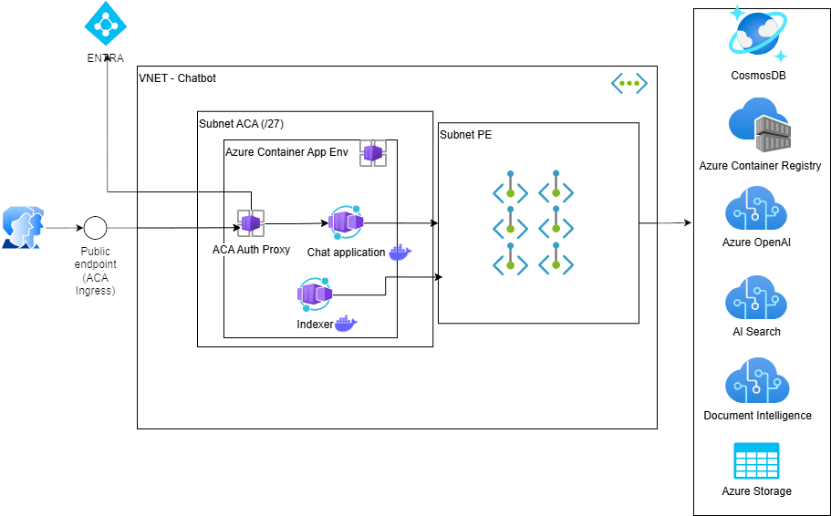

# Challenge 1: Establish Your Plan

## Introduction

After you learn the basics about generative AI, tools, and models, it's time to start building AI applications using the power of RAG (Retrieval Augmented Generation). 🤖 + 📚 = 🔥

In this Hackathon, you will go through a series of challenges to learn how to build RAG apps on top of the Azure platform. At the end, you will produce a complete application ready to scale using an agentic multi-modal RAG.

The final architecture should be similar to the one included in the following diagram:



The challenges are designed to be completed in order with increasing complexity: We will start using the Azure portal and the Azure AI Foundry, then we will move to Jupyter Notebooks and finally we will deploy the application using Azure Container Apps.

The list of the challenges is the following:

- **Challenge 0: Learn the Basics**: You will understand the basics of generative AI including tools and models. (Already completed)
- **Challenge 1: Establish the Plan**: You will prepare your development environment, deploy the infrastructure, establish the team plan and roles. (this challenge)
- **Challenge 2: Play with Azure AI Foundry**: Connect to an LLM for chat completion, ingest your docs in AzureSearch, play with the APIs.
- **Challenge 3: Start Coding**: Use Jupyter Notebook to connect with LLM and ingest the first documents.
- **Challenge 4: Advanced RAG**: You will ingest documents using the most advanced techniques (Advanced RAG) that take into account tables and images.
- **Challenge 5: Multi-Source, Multi-Agent RAG**: You will add additional sources to your RAG and create a multi-agent architecture.
- **Challenge 6: Add Actions**: You will add actions to your RAG to perform API calls to external services.
- **Challenge 7: Deploy your App**: You will develop and deploy your application using Azure Container Apps based on the Jupyter Notebooks you developed.

For the dataset, you can use the provided datasets or bring your own data.

The provided datasets contain the Annual (10-K) SEC reports in PDF format for the years 2019-2023 for Apple, Microsoft, Amazon, Nvidia, and Intel.
You can have a look at the datasets in the following path: `./data/fsi/pdf/`

---

## Challenge

This challenge is all related to Prepare your development environment and Deploy your initial infrastructure for the Hackathon.
The challenge is composed by the following steps:

- **Step 1**: Prepare your development environment
- **Step 2**: Deploy Azure AI Foundry resources
- **Step 3**: Update the ENV file with the necessary information
- **Step 4**: Deploy the final infrastructure (Optional - Can be done later after Challenge 5)

### Step 1. Prepare your development environment

We **Strongly** recommend using devcontainer as your development environment. The devcontainer is a Docker container that has all the necessary tools and libraries pre-installed. It will help you to have a consistent development environment across all team members and avoid any issues related to the installation of the required tools and libraries.

#### Dev Container setup

Make sure you have the following elements installed on your machine:

* [Visual Studio Code](https://code.visualstudio.com/)
* [Git](https://git-scm.com/downloads)
* [Windows Subsystem Linux 2](https://learn.microsoft.com/en-us/windows/wsl/install)
* [Docker Desktop 4.34 (or newer) with WSL2 Engine](https://docs.docker.com/desktop/windows/install/)
* [Visual Studio Code Dev Container extension](https://code.visualstudio.com/docs/devcontainers/tutorial#_install-the-extension)

Be sure also that **your docker is running with WSL2 engine** and it's able to download images from the Docker Hub.

To speed up the setup process, we suggest you to open Docker Desktop and pull already from Docker Hub the image `dbroeglin/its-a-rag:dev`.

> [!WARNING]
> **For Windows Users**:
\
> Do **NOT** directly `git clone` the repo in Windows and then open a DevContainer: This would create issues with file end of lines.
>
> If you are on Windows open PowerShell and execute the following command to disable automatic line ending transformation:
> ```bash
>git config --global core.autocrlf false
>```
>Then clone the repository using the following command in the terminal:
>
>```bash
>git clone https://github.com/francesco-sodano/itsarag.git
>```
>
>You can set it back to it's initial value after the workshop:
>```bash
>git config --global core.autocrlf true
>```

Open Visual Studio Code and:
1. Go to `File` > `Open Folder...` and open the cloned folder. 
2. Open the command palette with `Ctrl + Shift + P` and run the `Dev Containers: Reopen in Container` command on the repository. This command will create a Dev Container from your repository with every dependency and extension needed to finish the challenges.

> [!NOTE] 
> The devcontainer preparation will take up to **15 minutes** to complete. The image size to download is around 10Gb.

##### IDE Preparation

The Devcontainer provided already contains the following tools installed to complete all the challenges of this hackathon:

* [Git](https://git-scm.com/downloads)
* [Python 3.12](https://www.python.org/downloads)
* [Azure CLI 2.63.0 or newer](https://docs.microsoft.com/en-us/cli/azure/install-azure-cli)
* [Azure Developer CLI extension 1.9.7 or newer](https://learn.microsoft.com/en-us/azure/developer/azure-developer-cli/install-azd?tabs=winget-windows%2Cbrew-mac%2Cscript-linux&pivots=os-windows)

For Visual Studio Code, we also installed the following extensions for you:

* GitHub Copilot
* GitHub Copilot Chat
* GitHub Repositories
* Jupyter
* Docker
* PowerShell
* Python Environment Manager
* Remote Development
* vscode-pdf
* Bicep
* YAML

Feel free to use any other tools/extensions you think are necessary for your development environment and could help you to complete the challenges.

#### Azure Subscription Preparation

This Hackathon is designed to be run on Azure. Each participant needs an Azure subscription to complete the challenges.

You need to have at least the following roles assigned:

* Contributor
* User Access Administrator (if you are not owner of the subscription)
* Storage Blob Data Contributor


Be also sure that the following providers are registered in your subscription:

* Microsoft.App
* Microsoft.ContainerService
* Microsoft.Compute
* Microsoft.Storage
* Microsoft.Network
* Microsoft.ContainerRegistry
* Microsoft.KeyVault
* Microsoft.Insights
* Microsoft.OperationalInsights
* Microsoft.EventGrid
* Microsoft.AlertsManagement


Register the subscription providers to be able to deploy the infrastructure (after running az login):

```powershell
# Login to the Azure CLI
az login

# Select the default subscription
az account set --subscription <subscription_id>

# Register the providers
az provider register --namespace Microsoft.App --wait
az provider register --namespace Microsoft.ContainerService --wait
az provider register --namespace Microsoft.Compute --wait
az provider register --namespace Microsoft.Storage --wait
az provider register --namespace Microsoft.Network --wait
az provider register --namespace Microsoft.ContainerRegistry --wait
az provider register --namespace Microsoft.KeyVault --wait
az provider register --namespace Microsoft.Insights --wait
az provider register --namespace Microsoft.OperationalInsights --wait
az provider register --namespace Microsoft.EventGrid --wait
az provider register --namespace Microsoft.AlertsManagement --wait
```

### Step 2. Deploy Azure AI Foundry resources

For the next challenges, you need to deploy Azure AI Foundry in your subscription.
Although it is possible to deploy it using the Azure Portal, we recommend using the Azure CLI as it gives you more control over the deployment.

#### Create the Resource Group

First of all, you need to create a new resource group in **Central Sweden or Switzerland North** (ask your coach for the right location) and using that as a parameter for the deployment.
You can do this directly in Azure CLI (either the one integrated into the portal or your development environment) using the following commands:

```pwsh 
# Create a resource group
az group create --name <resource_group_name> --location <swedencentral or switzerlandnorth>
```

#### Deploy the Azure AI Foundry resources using Bicep

At the following path ```./infra/aistudio/```, you will find the necessary files to deploy the Azure AI Foundry using the Azure CLI (either the one integrated into the portal or your development environment).

You can use the following command to deploy the resources:

```pwsh 
# Create the Azure AI Foundry Hub
az deployment group create --resource-group Your_Resource_Group_Name --template-file main.bicep --parameters aiHubName=<unique_identifier>
```
The `aiHubName` parameter **must be 5 or less characters**. It can't be entirely numeric or contain the following characters: ```~ ! @ # $ % ^ & * ( ) = + _ [ ] { } \ | ; : . ' " , < > / ?.```. Our seggestion is to use the first character of your name, followed by 3-4 characters of your surname.

You will be also asked to provide the `administratorLoginPassword`. This is the password to access the SQL Server that will be created as part of the deployment. PLease be sure to use a complex password that meets these requirements:
- The password doesn't contain the account name of the user.
- The password is at least eight characters long.
- The password contains characters from three of the following four categories:
    - Latin uppercase letters (A through Z)
    - Latin lowercase letters (a through z)
    - Base 10 digits (0 through 9)
    - Nonalphanumeric characters such as: exclamation point (!), dollar sign ($), number sign (#), or percent (%).

Passwords can be up to 128 characters long. Use passwords that are as long and complex as possible.


> [!NOTE] 
> The deployment will take up to **12 minutes** to complete.

After the deployment is completed, check the resources created.

**Q:** *Can you explain what the resources are and how they interact with Azure AI Foundry?*

### Step 3. Update the ENV file with the necessary information

Now that you have deployed the Azure AI Foundry resources, you need to update the `.env` file with the necessary information.
As best practise, we do not commit any secrets in our Git repository we are using <a href="https://pypi.org/project/python-dotenv/">python-dotenv</a> to manager our environment variables. It will also make things easier when deploying the application in Azure.
So, you need to perform the following steps:
 - At the root of this repository copy `env.sample.txt` to `.env` 
 - Open `.env` and edit the variables for the resources for **Challenge 1: Establish your Plan** . You can edit variables for other challenges later when you get there.


### Step 4. Deploy the final infrastructure (Optional - Can be done later after Challenge 5)

As we want you concentrate on the AI App and not infrastructure, we have prepared a Bicep template that will deploy the necessary resources for the final architecture.

In the following path ```./infra/rag/```, you will find the necessary files to deploy the final infrastructure using ```azd up``` command.

> [!NOTE] 
> The deployment will work only when you will have a valid installation of your development environment as it use Docker in Docker to build the container images.

---

## Success Criteria

- You have prepared your development environment.
- You have created a new environment in Python and installed the required libraries.
- You have deployed Azure AI Foundry resources.

---

## Resources
- [Python environments (venv)](https://docs.python.org/3/library/venv.html)
- [Azure CLI](https://docs.microsoft.com/en-us/cli/azure/install-azure-cli)
- [Azure Developer CLI extension](https://learn.microsoft.com/en-us/azure/developer/azure-developer-cli/install-azd?tabs=winget-windows%2Cbrew-mac%2Cscript-linux&pivots=os-windows)
- [Windows Subsystem Linux 2](https://learn.microsoft.com/en-us/windows/wsl/install)
- [Docker Desktop](https://docs.docker.com/desktop/windows/install/)
- [ODBC Driver 18 for SQL Server](https://learn.microsoft.com/en-us/sql/connect/odbc/download-odbc-driver-for-sql-server?view=sql-server-ver16)
- [Azure AI Foundry](https://learn.microsoft.com/en-us/azure/ai-studio/overview)
- [Azure AI Foundry resources](https://learn.microsoft.com/en-us/azure/ai-studio/overview#resources)
