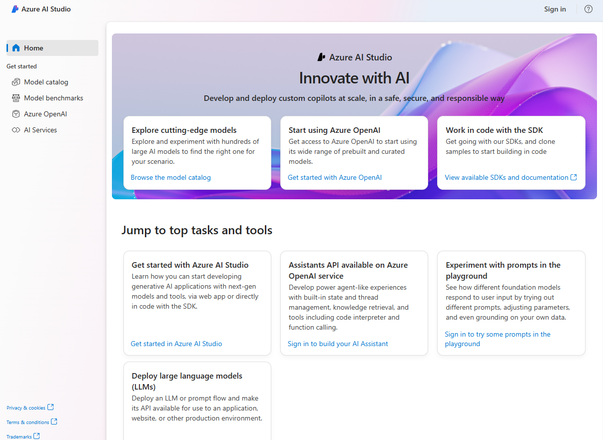

# Challenge 2: Play with Azure AI Studio

## Introduction

In this challenge, you will interact with Azure AI Studio, a web portal that consolidates various Azure AI services into a single, cohesive development environment. From here you will be able to deploy models and infer with the vanilla models in the Playground.
After that, you will add some of the data provided in the dataset and perform some queries to the models.

The two models that you will interact with are:

- Azure OpenAI GPT4o
- Phi-3-medium-128k-instruct

### What is Azure AI Studio?

The increasing adoption of artificial intelligence (AI), particularly generative AI, is driving the need for developers to build comprehensive AI solutions. These solutions must integrate machine learning models, AI services, prompt engineering, and custom code. While Microsoft Azure offers a variety of services for creating AI solutions, developers have traditionally had to juggle multiple tools and web portals within a single project.
Azure AI Studio simplifies this process by unifying features from Azure Machine Learning, Azure OpenAI, and other Azure AI services into one centralized workspace. This allows developers to collaborate seamlessly with data scientists and other team members in building AI solutions.



Specifically, Azure AI Studio integrates:

- The model catalog and prompt flow development features from Azure Machine Learning.
- The deployment, testing, and custom data integration capabilities for generative AI models from Azure OpenAI service.
- Integration with Azure AI Services for speech, vision, language, document intelligence, and content safety.

Beyond offering a unified interface for these AI services, Azure AI Studio also supports:

- Creating Azure AI hubs, which serve as collaborative development workspaces for data scientists, developers, and other stakeholders to build AI solutions.
- Managing assets and code for specific solutions within dedicated projects.
- Scalable, on-demand compute resources.
- Seamless integration with data sources and other cloud services.
- Web-based environments for code development.
- SDKs and CLI libraries for automation.

Azure AI Studio enables teams to collaborate efficiently and effectively on AI projects, such as developing custom copilot applications that use large language models. Tasks you can accomplish with Azure AI Studio include:

- Deploying models from the model catalog to real-time inferencing endpoints for client applications to consume.
- Deploying and testing generative AI models in an Azure OpenAI service.
- Integrating data from custom data sources to support a retrieval augmented generation (RAG) approach to prompt engineering for generative AI models.
- Using prompt flow to define workflows that integrate models, prompts, and custom processing.
- Integrating content safety filters into a generative AI solution to mitigate potential harms.
- Extending a generative AI solution with multiple AI capabilities using Azure AI services.

---

## Challenge

This challenge focuses on using the Azure AI Studio to interact with the models and the data provided in the dataset.
The challenge is composed of the following steps:

- **Step 1**: Create a Project in Azure AI Studio
- **Step 2**: Deploy the required LLM Models
- **Step 3**: Use the Azure AI Studio Playground with the vanilla models
- **Step 4**: Deploy the additional required services
- **Step 5**: Add some of the data provided in the dataset and perform some queries on the models
- **Step 6**: Use the Azure AI Studio Playground with the new data

Here are the high-level steps to complete this challenge:

### Step 1. Create a Project in Azure AI Studio

After the deployment is completed, you need to create a project in the Azure AI Studio. You can do this by accessing the Azure AI Studio from the Azure Portal.

**Q:** *What are the main reasons to have different projects in the same hub?*

### Step 2. Deploy the required LLM Models

In the Azure AI Studio, you can deploy models from the model catalog to real-time inferencing endpoints for client applications to consume. For this challenge, you need to deploy the following models under the project created in the previous step:
   - Azure OpenAI GPT4o (gpt-4o | serverless API) - Global Standard - 150k Tokens per minute
   - Phi-3-medium-128k-instruct (serverless API)

**Q:** *What are the main differences between serverless and Managed Compute? Why do we suggest deploying serverless for a RAG implementation?*
**Q:** *What are the main differences between the two models? Also, consider costs. What other model would you suggest using for a simple RAG?*

### Step 3. Use the Azure AI Studio Playground with the vanilla models

Now that you have the models deployed, you can use the Azure AI Studio Chat Playground to interact with the models.

> [!IMPORTANT]  
> The next questions only apply if you are using the provided dataset. If you are using your own dataset, you have to create your own questions.

Try to ask the following questions on all models deployed:
- What are the revenues of Google in the year 2000?
- What are the revenues and the operative margins of Alphabet Inc. in 2022 and how it compares with the previous year?
- Can you compare and create a table with the revenue of Alphabet Inc., NVIDIA, MICROSOFT, APPLE and AMAZON in years 2023?
- Did APPLE repurchase common stock in 2023? create a table of Apple repurchased stock with date, numbers of stocks and values in dollars.
- Can you give me the Fiscal Year 2023 Highlights for Apple, Microsoft, Nvidia and Google?

**Q:** *How the answers compares?*

### Step 4. Deploy the additional services required

Now, after you compared the models and the answers, let's provide additional data sources to the models.
To be able to do that and create the first version of your RAG Playground, you need some other components:

- A retrieval service: to be able to search the data and provide it to the models.
- An embedding model: to be able to vectorize the data and capture its semantic meaning.
- A vector database and index: to store the vectorized data and make it searchable.

In this step, you need to deploy and configure the following services:

- The OpenAI model "text-embedding-ada-002": this will be our Embedding Model.
- Azure AI Search: this will be our retrieval service and VectorDB.
- A Blob Storage Account: this is where the indexes will be stored.

> [!NOTE]
> If you used the Bicep template to deploy the Azure AI Studio, you already have the Azure AI Search and a blob storage for data deployed in your resource group. You still need to deploy the Embedding Model.

For the Embedding Model, be sure you assign at **least 100k Tokens per minute**.

### Step 5. Add some of the data provided in the dataset and perform some queries to the models

With all the services deployed, you need to add some of the data provided (```its-a-rag/data/fsi/pdf/```) in the dataset to the Azure AI Search and Blob Storage.
The high-level steps to complete are:

- Import the following file in a container in the blob storage including <\*ragdata\*> (name dependent on your environment), after creating a container named 'data'.
    - *2023 FY AMZN.pdf*
    - *2023 FY AAPL.pdf*
    - *2023 FY GOOGL.pdf*
    - *2023 FY MSFT.pdf*
    - *2023 FY NVDA.pdf*

  You can use the Azure Portal or the Azure Storage Explorer to upload the files. the best option is group them into a folder.

- Add CORS rules to the Blob Storage. (`https://mlworkspace.azure.ai,https://ml.azure.com,https://*.ml.azure.com,https://ai.azure.com,https://*.ai.azure.com`- ALL except MERGE -  remember to allow all headers)
- Add a connection for the data source to the Azure AI Studio.
- Add Storage Blob Data Reader to your user account on the Blob storage.
- For the AI Studio Hub Managed identity, AI Studio Project grant permission to the Blob Storage (Blob Storage Data Contributor).
- Add a connection to the AI Search Service in Azure AI Studio.

> **ATTENTION:** 
> Due to a limitation (this is a preview feature) in the Azure AI Studio, **you need to change Firewall rule for the Public Network Access on both the Blob Storage Accounts to "Enabled from All Networks"**.
> 
> Also, you need to enable for BOTH Storage accounts the **Allow storage account key access** in Settings -> Configuration.

- Perform embeddings and vectorization of the data

> **NOTE:** 
> The indexing will take up to 10 minutes to complete.

### Step 6. Use the Azure AI Studio Playground with the new data

Now that you have your data indexed, let's try to ask the same questions as before in the Azure AI Studio Playground Chat.

Be sure you enable "Hybrid (vector + keyword)" search to improve the results.

Try to ask the following questions on all models deployed:

- What are the revenues of GOOGLE in the year 2000?
- What are the revenues and the operative margins of ALPHABET Inc. in 2022 and how it compares with the previous year?
- Can you compare and create a table with the revenue of ALPHABET Inc., NVIDIA, MICROSOFT, APPLE and AMAZON in years 2023?
- Can you give me the Fiscal Year 2023 Highlights for APPLE, MICROSOFT, NVIDIA and GOOGLE?
- Did APPLE repurchase common stock in 2023? create a table of APPLE repurchased stock with date, numbers of stocks and values in dollars.
- What is the value of the cumulative 5-years total return of ALPHABET Class A stock at December 2022?
- What was the price of APPLE, NVIDIA and MICROSOFT stock in 23/07/2024?
- Can you buy 10 shares of APPLE for me?


Check if both models are working as expected. You may be surprised...

**Q:** *What are the main differences between the answers now and before?*

Continue to play with the Azure AI Studio and the models deployed asking addtional questions based on the document provided.

**Q:** *Did you find any limitations, hallucinations or missing answer even if the document contains the information?*

---

## Success Criteria

- You have the Azure AI Studio fully operational with vanilla models and with the ability of adding your own data.
- You have answered all the questions provided and able to explain the behavior of the coaches.

## Resources

* [Introduction to Azure AI Studio](https://learn.microsoft.com/en-us/training/modules/introduction-to-azure-ai-studio)
* [Explore and deploy models from the model catalog in Azure AI Studio](https://learn.microsoft.com/en-us/training/modules/explore-models-azure-ai-studio/)
* [Build a RAG-based copilot solution with your own data using Azure AI Studio](https://learn.microsoft.com/en-us/training/modules/build-copilot-ai-studio/)
* [Content retrieval in Azure AI Search](https://learn.microsoft.com/en-us/azure/search/retrieval-augmented-generation-overview#content-retrieval-in-azure-ai-search)
* [Azure OpenAI Service documentation](https://learn.microsoft.com/en-us/azure/ai-services/openai/)
* [Azure AI Search documentation](https://learn.microsoft.com/en-us/azure/search/)
* [Azure AI Search Skillset concepts](https://learn.microsoft.com/en-us/azure/search/cognitive-search-working-with-skillsets)
