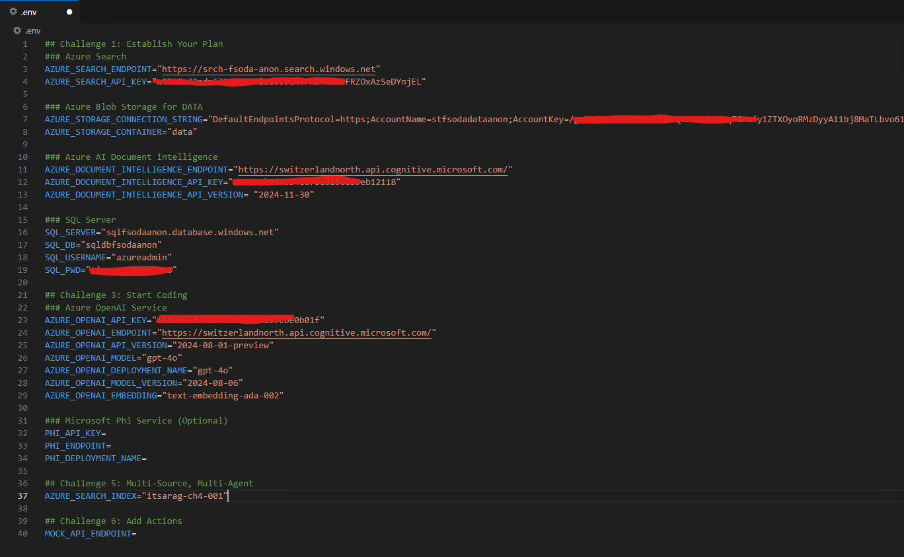

# Challenge 3: Start Coding

## Introduction

In this challenge, you will interact with a Jupyter Notebook and interact with the models using Python and APIs. In the first part, you will perform some inferences with the vanilla models, you will add some of the data provided in the dataset, and perform some queries to the models.

## Challenge

- Open the Jupyter Notebook provided.
- Follow the instructions in the notebook to complete the challenge.
    - Play with the vanilla models.
    - Add some of the data provided in the dataset and perform some queries to the models.

Here you have the high-level steps to complete:

### Step 1. Update your .env file with the additional infomations

Now that you have deployed the Azure AI Foundry resources, you need to update the `.env` file with the necessary information.

So, you need to perform the following steps:
 - Open `.env` and edit the variables for the resources for **Challenge 3: Start Coding** . You can edit variables for other challenges later when you get there.

Here you can find an exmaple of the `.env` file completed:



### Step 2. Play with the vanilla models

In this step, you will interact with the models using Python and APIs as you did using the Azure AI Studio Playground.
For this challenge we will use the OpenAI python library to interact with the models.
You will do the some approach using both OpenAI GPT4o and Phi-3-medium-128k-instruct models.

Try to ask the same set of questions you provided in the first part of the challenge and compare the answers.

### Step 3. Add some of the data provided in the dataset and perform some queries to the models

In this step, we will bring our own data to the models and perform some inferences.
To make the entire process simpler, we will use a LLM Framework: [LangChain.](https://python.langchain.com/v0.2/docs/introduction/)

LangChain is an open-source framework designed to simplify the development of applications powered by large language models (LLMs). It provides a set of tools and libraries to help developers build, deploy, and manage applications that leverage LLMs for tasks such as chatbots, document analysis, code analysis, and more.
LangChain supports both Python and JavaScript, making it versatile for different development environments.

The High level steps to complete when using a framework like Langchain are:

- **Index**:
  - Load the documents
  - Split and Chunk the documents using one of the many available splitter in the framework (we suggest to have a look at *RecursiveCharacterTextSplitter*)
  - Store and index the chunks as vectors in a vector database
- **Retrieve**:
  - Create a retriever that use the vector database to search for the relevant vectors in the documents
- **Generate**:
  - Create a LLM client
  - Use a chain to retrieve the relevant documents, get the question, generate the combined prompt and get the output
- **Test**
  - Test the model with the questions provided

the Azure services involved in this steps are the following:
 - Azure Blob Storage: to store the documents
 - Azure AI Search: to store the indexes
 - Azure OpenAI Service: as model to generate the answers.

Let use the same set of documents we highlighted in the previous challange (stored in  the ```its-a-rag/data/fsi/pdf/``` folder of the repository):
- *2023 FY AMZN.pdf*
- *2023 FY AAPL.pdf*
- *2023 FY INTC.pdf*
- *2023 FY MSFT.pdf*
- *2023 FY NVDA.pdf*

---

## Success Criteria

- You asked the same set of questions provided in Challenge 2. 
- You have the answers provided by the vanilla models.
- You have answers provided by the RAG. If the answer was not in the context provided, the solution report "I don't know".

---

## Resources

* [Azure OpenAI Service documentation](https://learn.microsoft.com/en-us/azure/ai-services/openai/)
* [Azure AI Search documentation](https://learn.microsoft.com/en-us/azure/search/)
* [Azure AI Search Skillset concepts](https://learn.microsoft.com/en-us/azure/search/cognitive-search-working-with-skillsets)
* [Working with Jupyter Notebooks in Visual Studio Code](https://code.visualstudio.com/docs/datascience/jupyter-notebooks)
* [Get started with Jupyter notebooks for Python](https://learn.microsoft.com/en-us/training/modules/python-create-run-jupyter-notebook/)
* [Develop Generative AI solutions with Azure OpenAI Service](https://learn.microsoft.com/en-us/training/paths/develop-ai-solutions-azure-openai/)
* [Langchain documentation](https://python.langchain.com/docs/introduction/)
* [Langchain components (chat models, embedding models, vector stores, retrievers, ...)](https://python.langchain.com/docs/integrations/components/)