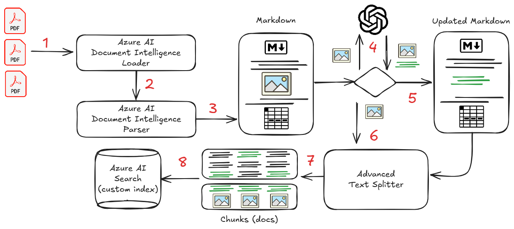
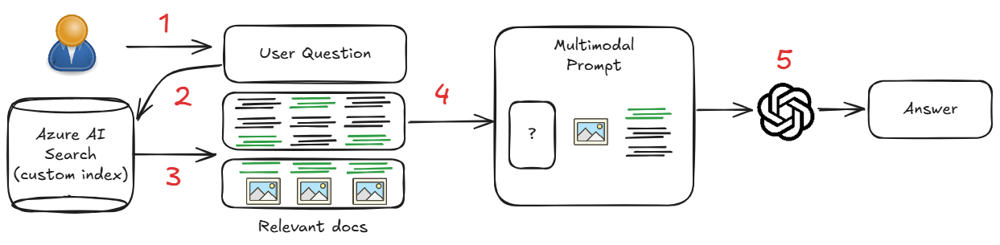

# Challenge 4 – Advanced RAG with Azure AI Document intelligence

## Introduction

As the basic RAG could be a good exercise to understand the basic concepts, many documents in a real scenario, are not just text: They are a combination of text, images, tables, etc. 

In this challenge, you will create a more advanced RAG application able to deal with this kind of documents.
For this reason, you will use Azure AI Document Intelligence to extract the text, images, and tables from the documents and use them as input for the RAG model.

## Azure AI Document Intelligence

Azure AI Document Intelligence is a cloud-based Azure AI service that enables you to build intelligent document processing solutions. Massive amounts of data, spanning a wide variety of data types, are stored in forms and documents. Document Intelligence enables you to effectively manage the velocity at which data is collected and processed and is key to improved operations, informed data-driven decisions, and enlightened innovation.

In particular, we will use the Document Intelligence **Layout model**. this model is an advanced machine-learning based document analysis API available in the Document Intelligence cloud. It enables you to take documents in various formats and return structured data representations of the documents (markdown). It combines an enhanced version of our powerful Optical Character Recognition (OCR) capabilities with deep learning models to extract text, tables, selection marks, and document structures.

## ITSARAG Azure AI Document intelligence Loader, Advanced Text Splitter and Embedding/indexing System.

Even if Langchain includes a document loader for Azure AI Document Intelligence, the implementation is basics and not includes all the features required for a complex advanced RAG.

For this reason, we provided an enhanced version of the Azure AI Document Intelligence Classes as well as the Text Splitters and a custom index that you can use in this challenge for the Advanced RAG.

The flow implemented in the custom module for the **indexing phase** in the following:

1. The Azure AI Document Intelligence Loader will load the document from the file location
2. The parser will generate a markdown version of the PDF using the Azure AI Document Intelligence Layout model with OCR capabilities.
3. the markdown is parsed to identify the images present in the document.
4. The images are extracted and sent to Azure OpenAI to generate a text description of the image.
5. the text received will be added to the markdown document on behalf of the image.
6. Themarkdown will be splitted using the custom Text Splitters.
7. The splitted text, the description of the image and the base64 encoding of the image is added side by side to the text.
8. The chunks are vectorized and indexed in the custom index using Azure AI Search.

  

The flow implemented for the **retriever phase** is the following:

1. The user question is captured
2. the question is sent to the Azure AI Search to retrieve the most relevant chunks.
3. The Azure AI Search index will return the most relevant chunks of text and as well any image where the description is relevant to the question.
4. The chunks are sent to the RAG model in multimodal prompt (text+image).
5. the LLM model will generate the answer to the question and provide it to the user.

  

## Challenge

You can start now to create the Advanced RAG solution in a notebook.

Use, as starting point, the provided notebook in challenge 4 folder and the provided modules in the './src/itsarag' folder.

the high level steps are the following:

1. Create the vector store with the custom index, and the Azure OpenAI Chat Client
2. Implement the Azure AI Document Intelligence Loader (be aware that the loader is only able to get one file at the time)
3. Implement the Text Splitters object and use it to create 
4. Use the vector store as retriever
5. Create the LangChain Chain to generate the answer.
6. At this point you are ready to test the solution.

## Success Criteria

- You have a working Advanced RAG solution that works with multimodal prompt.
- You are able to provide the answers for the proposed questions to the coach using your solution.

## Resources

- [Azure AI Document Intelligence](https://learn.microsoft.com/en-us/azure/ai-services/document-intelligence/?view=doc-intel-4.0.0&branch=release-build-cogserv-forms-recognizer)
- [Azure AI Document Intelligence Layout model](https://learn.microsoft.com/en-us/azure/ai-services/document-intelligence/concept-layout?view=doc-intel-4.0.0&tabs=sample-code)