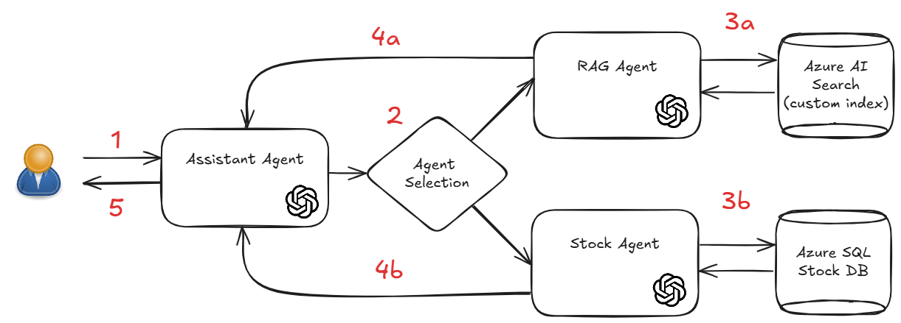

# Challenge 5 – Multi-Source, Multi-Agent

## Introduction

Now that we have a working Advanced RAG solution, we can start adding additional features to our solution.
The best way to do this is to create a **multi-agent architecture** where each agent is responsible for a different task.

In this challenge, we will add another source of data to our solution: a SQL Database.

the high level logical architecture for the multi-agent solution we are going to create is the following:

  

The high level flow of the solution is the following:

1. The user sends a question to the assistant agent.
2. The assistant agent do an interpretation of the question and decide to which agent the question should be sent.
3. a) If the question is related to the document stored in Storage account, the assistant agent sends the question to the RAG agent.
3. b) If the question is related to the data stored in the SQL Database, the assistant agent sends the question to the Stock agent.
4. a) The RAG agent retrieves the answer from the document stored in the Storage account and sends the answer back to the assistant agent.
4. b) The Stock agent retrieves the answer from the SQL Database performing a correct SQL query and sends the answer back to the assistant agent.
5. The assistant agent sends the answer back to the user.

## LangGraph

For this challenge we will use another component of the Langchain family: LangGraph.

LangGraph is a library for building stateful, multi-actor applications with LLMs, used to create agent and multi-agent workflows. Compared to other LLM frameworks, it offers these core benefits: cycles, controllability, and persistence. LangGraph allows you to define flows that involve cycles, essential for most agentic architectures, differentiating it from DAG-based solutions. As a very low-level framework, it provides fine-grained control over both the flow and state of your application, crucial for creating reliable agents. Additionally, LangGraph includes built-in persistence, enabling advanced human-in-the-loop and memory features.

LangGraph is used in this challenge to define the decision tree logic.

The key concepts of LangGraph are the following:

- **Stateful Graph:** LangGraph revolves around the concept of a stateful graph, where each node in the graph represents a step in your computation, and the graph maintains a state that is passed around and updated as the computation progresses.
- **Nodes:** Nodes are the building blocks of your LangGraph. Each node represents a function or a computation step. You define nodes to perform specific tasks, such as processing input, making decisions, or interacting with external APIs.
- **Edges:** Edges connect the nodes in your graph, defining the flow of computation. LangGraph supports conditional edges, allowing you to dynamically determine the next node to execute based on the current state of the graph.

## Challenge

In this challenge, you will build on top of the previous one.

The advanced RAG solution you have created will be one of the node of the new multi-agent solution: the RAG agent.

You will now create a new agent, the Stock agent, that will be responsible for retrieving the answer from the SQL Database.

This challenge has three steps:

### Step 1. Import data to the SQL Database

As you have already the SQL Server and the SQL database in the deployed resources in Azure, You should now use the provided SQL Script in `./data/fsi/db/create_stock_table.sql` to create the table `Stock` and populate it with the provided data.

To accomplish this task, you should use SQLAlchemy and its Engine class as it will be used in the LangGraph SQL Agent in the next step.

**NOTE**: Be sure that your IP address is not allowed to access the server.  To enable access, use the Azure Management Portal.
It may take up to five minutes for this change to take effect.

### Step 2. Create a Langchain SQL Agent

Now that you have the engine connected to the SQL Database and the data imported, it's time to create your first agent.

For this task, you should use the LangGraph SQL Databse Toolkit to use the LLM model to translate your questions into SQL query to be executed.

## Step 3. Create the Multi-Agent solution

Now it's time to put all the pieces together!

- Create you start agent that will be responsible for receiving the question from the user and decide to which agent the question should be sent.
- Create the RAG agent that will be responsible for retrieving the answer from the document stored in the Storage account leveregin the Advanced RAG solution you have created in the previous challenge. (You will reuse all the code already created in Challenge 4).
- Create the Stock agent that will be responsible for retrieving the answer from the SQL Database using the experience you have gained in the previous steps. You will reuse all the code created in the previous step.

Now you should create the LangGraph to define the decision tree logic.

## Success Criteria

- You have a working Multi-Agent solution.
- You are able to provide the answer for the proposed questions to the coach using your solution.

## Resources

- [SQLAlchemy Connection to Azure SQL DB](https://docs.sqlalchemy.org/en/20/dialects/mssql.html)
- [LangGraph Documentation](https://langchain-ai.github.io/langgraph/)
- [LangGraph SQL Database Toolkit](https://python.langchain.com/docs/integrations/tools/sql_database/)
- [Beginner Guide for LangGraph](https://medium.com/@cplog/building-tool-calling-conversational-ai-with-langchain-and-langgraph-a-beginners-guide-8d6986cc589e#:~:text=Beginner%20tutorial%20on%20how%20to%20design,%20create%20powerful,)