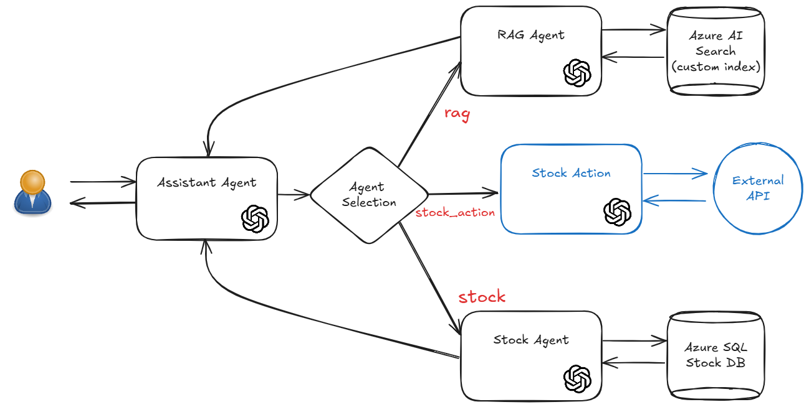

# Challenge 6: Add Actions

## Introduction

In this challenge we will add an addtional agent to our multi-agent solution: **the Stock Action** agent.

The Stock Action agent will be the first agent in this solution to not retrieve informtion but to perform action on behalf of the user.

the high level logical architecture for the multi-agent solution we are going to create is the following:

<div style="text-align: center;">
  
</div>

To help you with this challenge, we provide a simple application that mimic the behivour of the Bank agency that permit you to buy/sell stocks.

Here you can find the API information: 

#TODO add the API information

## Challenge

## Step 1. Deploy the final architecture

If you didn't perform the final architecture deployment in Challenge 1 (Step 4), now it's time to do it.

You can deploy the final architecture by executing the following command in the root of your repository:

In the root of your repository execute the following command: 
```bash
azd auth login
azd up
```

While [AZD](https://learn.microsoft.com/en-us/azure/developer/azure-developer-cli/) provisions your Azure infrastructure and the sample application, let's have a look at the actual code.


## Step 2. Build the Stock Action agent

You will now continue to build on top of what you did in the previous challenge.

You will now create a new agent, the Stock Action agent, that will be responsible for performing actions on the Stock API.
You need also to modify the Assistant agent to be able to send the question to the Stock Action agent if the question is related to the Stock API and consequently also the langgraph workflow.

Be sure that the Stock Action agent is able only to perform actions on the defined stocks.

## Success Criteria

- You have a working Multi-Agent solution that includes the Stock Action agent.
- You are able to provide the answer for the proposed questions to the coach using your solution.

## Resources
- [LangGraph Documentation](https://langchain-ai.github.io/langgraph/)
- [LangChain Tools](https://python.langchain.com/docs/how_to/#tools)
- [OpenAI Tools](https://python.langchain.com/v0.1/docs/modules/agents/agent_types/openai_tools/)
- [Building a simple Agent with Tools](https://towardsdatascience.com/building-a-simple-agent-with-tools-and-toolkits-in-langchain-77e0f9bd1fa5#:~:text=Let%E2%80%99s%20build%20a%20simple%20agent%20in%20LangChain%20to)
