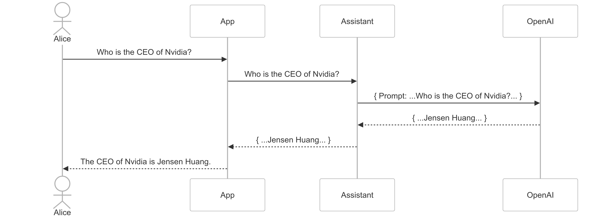

# Challenge 7 – Deploy your App

## Introducton

Now that our solution is working in a Jupyter notebook we will create an app
to deploy it and make it available to our users.

We start with a simple chat app connected to OpenAI:



However, rather than putting all the code in the Chainlit App we create an intermediary class `Assistant` which will contain the agents code. This makes for better decoupling between the UX and AI parts of the application. 

It also allows us to more easily test our code without having to run the application and simulate actual user interactions. Those tests can be valuable if the UI gets more complicated. In our case, the part that needs testing is the `Assistant`.

## Challenge

In this challenge, you will re-use what you have done in the previous one and 
integrate the code in a web application providing a chat user interface.

### Step 0. Deploy a clean index

Use Jupyter Notebook `challenge7.ipynb` to deploy a clean and full index in your target environment.

### Step 1. Deploy the sample code to Azure

In the root of your repository execute the following command: 
```bash
azd up
```
If you run `azd` for the first time it might fail and ask you to authenticate to your Azure environment. Do so by following the instructions and re-run `azd up`.

While [AZD](https://learn.microsoft.com/en-us/azure/developer/azure-developer-cli/) provisions your Azure infrastructure and the sample application, let's have a look at the actual code.

All the following commands will happen in directory `src/chat-app`:

```bash
cd src/chat-app
```

### Step 2. Get to know the sample code

The sample code in `its-a-rag/src/chat-app` includes the following components:

1. **app.py**: This is the main entry point of the application. It sets up the web server and routes for the chat interface.
2. **assistant.py**: This file contains the `Assistant` class, which encapsulates the logic for interacting with the OpenAI API. **Add your code here so that you don't have interferences with the UX code. Also, it will allow you to more easily test  your code with [pytest](https://docs.pytest.org/en/stable/)
3. **public/**: This directory contains static assets such as images used by the web application.
5. **tests/**: This directory includes test cases for the `Assistant` class and other components of the application. These tests ensure that the logic works correctly without needing to run the entire web application.

Spend some time to understand these components, you should then be able to modify and extend the chat application to meet the requirements of the challenge.

To run the application you can execute the following command in your terminal:
```bash
chainlit run app.py
```

You can test your application at the following URL: [http://localhost:8000](http://localhost:8000)

### Step 3. Let's test our code

To test our code we will be using [pytest](https://docs.pytest.org/en/stable/). If you are unfamiliar with the framework take a bit of time to visit the their documentation and get familiarized with it.

To run the tests simply run:
```bash
pytest
```

### Step 4. Integrate the assistant's code

Right now the application sends the user question directly to the LLM. In this step you are collecting your code from previous challenges to and integrating it in `assistant.py`.

Use the exisiting test case, and write additional ones to validated that your integration is working successfully.

What are the challenges associated with using [Unit Testing](https://en.wikipedia.org/wiki/Unit_testing) to test an AI application?

### Step 5. Deploy the code to Azure

To deploy the code to azure we just need to run:

```bash
azd deploy
```

This will re-deploy the application code into the infrastructure we provisioned in step 1.

## Success Criteria

- Your application is successfully deployed in Azure.
- Your application gives _accurate_ answers to the sample questions provided in the application (click on the various questions and run them through the application).

## Resources

* [Azure Developer CLI (azd)](https://learn.microsoft.com/en-us/azure/developer/azure-developer-cli/) simplifies provisioning of our Azure infrastructure and deployment of our applications
* [pytest](https://docs.pytest.org/en/stable/) is a Python testing framework that helps us automate application testing without having to run the full application or deploy it in Azure.